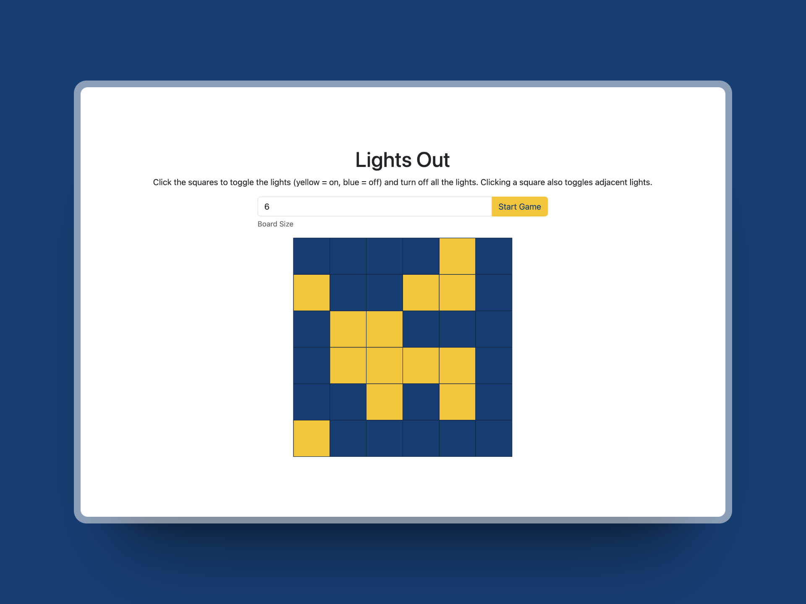

# [Lights Out Game](https://cs4640.cs.virginia.edu/azk7ad/hw7)

  

This is a simple implementation of the classic Lights Out game. The game involves toggling lights on a grid to turn off all the lights. It's implemented using client-side JavaScript and jQuery, with a PHP backend for initial game setup. This game was developed for CS 4640 - Web Programming at the University of Virginia.
You can play the game [here](https://cs4640.cs.virginia.edu/azk7ad/hw7).

## How to Play

- Enter the desired grid size in the input field.
- Click on 'Start Game' to begin.
- Click on cells to toggle lights. The goal is to turn off all the lights.
- Adjacent lights (up, down, left, right) will also toggle when a cell is clicked.
- When all lights are off, you win!
- To start a new game, click on 'Start Game' again.

## Game Rules

- Yellow cells represent lights that are on.
- Blue cells represent lights that are off.
- Clicking a cell toggles its light and the adjacent lights.
- The objective is to turn off all the lights on the grid.

## Technologies Used

- HTML
- CSS with Bootstrap
- JavaScript
- jQuery
- PHP
- [canvas-confetti](https://github.com/catdad/canvas-confetti) for confetti effect
